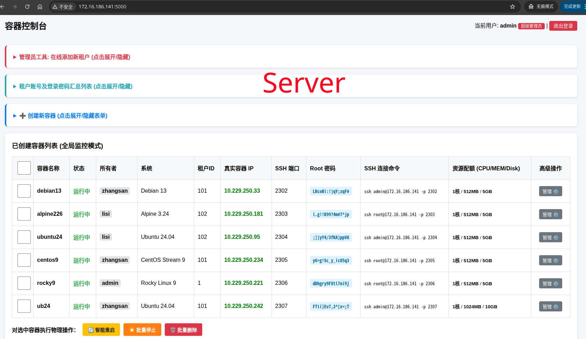
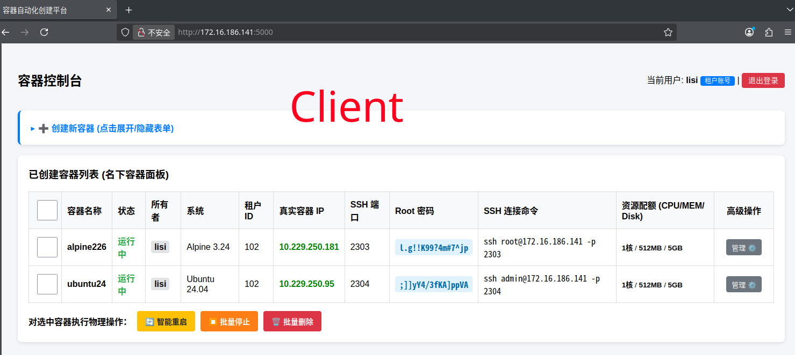
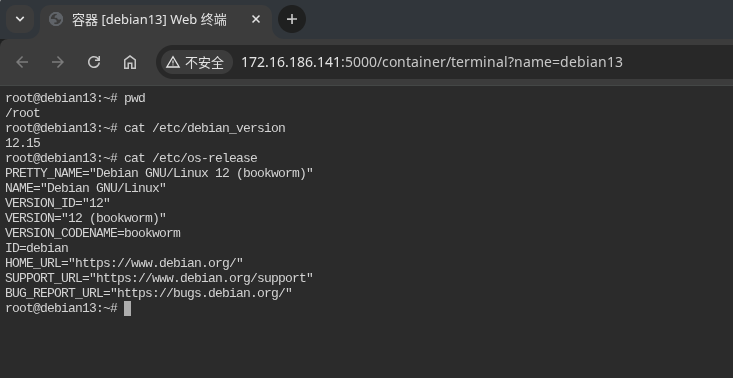
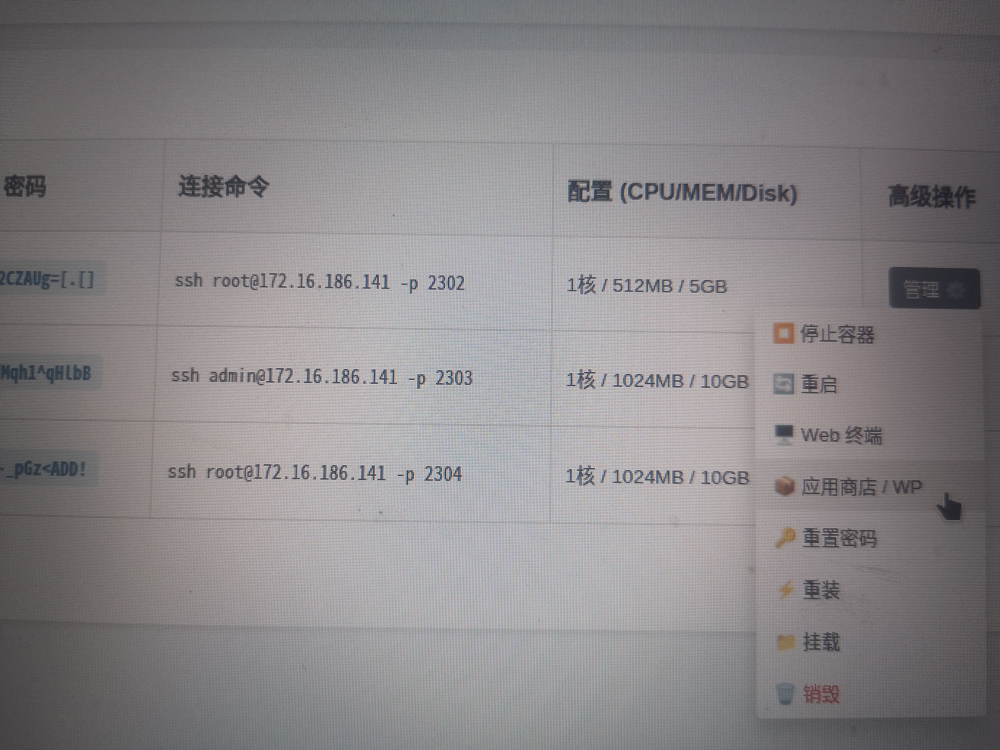

# 前奏
```shell
注："第一版" 和 "第二版" 这2个目录以外的文件是共用的！！！
README中的内容是基于"第一版"，和"第二版"的区别是app.py拆分成了多个文件且增加了几个文件


rambo@debian137:~$ cat /etc/debian_version
13.7
rambo@debian137:~$ uname -a
Linux debian137 6.12.107+deb13-amd64 #1 SMP PREEMPT_DYNAMIC Debian 6.12.107-1 (2026-08-29) x86_64 GNU/Linux

rambo@debian137:~$ grep -v ^# /etc/apt/sources.list | grep -v ^$
deb http://deb.debian.org/debian/ trixie main non-free-firmware
deb-src http://deb.debian.org/debian/ trixie main non-free-firmware
deb http://security.debian.org/debian-security trixie-security main non-free-firmware
deb-src http://security.debian.org/debian-security trixie-security main non-free-firmware
deb http://deb.debian.org/debian/ trixie-updates main non-free-firmware
deb-src http://deb.debian.org/debian/ trixie-updates main non-free-firmware

rambo@debian137:~$ sudo apt update && sudo apt install -y vim wget curl net-tools openssh-server
 

```


# 安装传统(原生)LXC
```shell
rambo@debian137:~$ sudo apt install -y \
lxc lxc-templates \
debootstrap bridge-utils \
uidmap apparmor \
apparmor-utils dnsmasq-base

检查宿主机内核是否具备 LXC 所需功能：
rambo@debian137:~$ sudo lxc-checkconfig

重点观察是否有 enabled、available 或类似正常状态

检查AppArmor：
rambo@debian137:~$ sudo systemctl enable --now apparmor
rambo@debian137:~$ sudo aa-status
如果 lxc-checkconfig 中出现某些功能缺失，先不要创建生产容器，应先解决内核或相关软件包问题

启动网络服务：
rambo@debian137:~$ sudo systemctl enable --now lxc-net
rambo@debian137:~$ sudo systemctl restart lxc-net
rambo@debian137:~$ systemctl status lxc-net
如果能看到 lxcbr0，说明宿主机的 LXC NAT 网桥基本建立成功。LXC 默认的独立网桥通常使用私有网段，并通过宿主机进行 NAT；这种方式适合先学习和运行普通服务

# 查看镜像
rambo@debian137:~$ sudo lxc-ls

# 查看传统LXC容器列表
rambo@debian137:~$ sudo lxc-ls -f

# 查看容器目录
rambo@debian137:~$ sudo ls -lh /var/lib/lxc/

# 查看状态
rambo@debian137:~$ sudo lxc-info -n <CONTAINER_NAME>

# 进入容器
rambo@debian137:~$ sudo lxc-attach -n <CONTAINER_NAME>  --clear-env -- /bin/bash
root@xxx:/# 
apt update && apt install -y ca-certificates curl vim sudo wget curl systemd
echo "root:aaaaaa" | chpasswd
exit

# 查看容器IP
rambo@debian137:~$ sudo lxc-attach -n <CONTAINER_NAME>  --clear-env -- ip a sh eth0

# 启停容器
rambo@debian137:~$ sudo lxc-{start|stop|restart} -n <CONTAINER_NAME>

# 查看信息
rambo@debian137:~$ sudo lxc-info -n <CONTAINER_NAME>

# 删除容器
rambo@debian137:~$ sudo lxc-destroy -n <CONTAINER_NAME>

# 设置容器开机自动启动
rambo@debian137:~$ sudo vim /var/lib/lxc/<CONTAINER_NAME>/config
lxc.start.auto = 1 
lxc.start.delay = 5

# 测试
rambo@debian137:~$ sudo systemctl {start|stop|restart|status} lxc


# 在容器内部部署服务
以 Nginx 为例：
rambo@debian137:~$ sudo lxc-attach -n debian01 --clear-env -- bash -c '
apt update && DEBIAN_FRONTEND=noninteractive &&
apt install -y nginx &&
systemctl enable nginx && systemctl restart nginx'

# 查看服务
rambo@debian137:~$ sudo lxc-attach -n <CONTAINER_NAME>  --clear-env -- systemctl status nginx

# 查看监听端口
rambo@debian137:~$ sudo lxc-attach -n <CONTAINER_NAME>  --clear-env -- netstat -anpt|grep 80


# 宿主机目录和容器数据
不要把重要数据只放在容器根文件系统中。可以在宿主机创建独立数据目录：
rambo@debian137:~$ 
sudo mkdir -p /srv/lxc/debian01-data
sudo chown root:root /srv/lxc/debian01-data
sudo chmod 0750 /srv/lxc/debian01-data

rambo@debian137:~$ sudo ls -ldn /srv/lxc/debian01-data
drwxr-x--- 2 0 0 4096 Sep 20 08:42 /srv/lxc/debian01-data
注：0 0就是宿主机上的 root 用户和 root 组

然后在容器配置中加入挂载：
rambo@debian137:~$ sudo vim /var/lib/lxc/debian01/config
lxc.mount.entry = /srv/lxc/debian01-data  mnt/data none bind,create=dir 0 0            # 挂载选项


rambo@debian137:~$ sudo lxc-stop -n debian01 && sudo lxc-start -n debian01

容器重启后，宿主机的/srv/lxc/debian01-data 会对应到容器内的/mnt/data
数据库、上传文件、媒体文件等重要数据建议放在这种独立目录中，方便备份和迁移
rambo@debian137:~$ echo "5555" | sudo tee /srv/lxc/debian01-data/1.txt
5555

# 查看容器内的1.txt
rambo@debian137:~$ sudo lxc-attach -n debian01 --clear-env -- cat /mnt/data/1.txt
5555

```


# 安装/配置web端控制容器
```shell
# debian13需要安装incus
rambo@debian137:~$ sudo apt install -y incus
rambo@debian137:~$ sudo incus admin init --auto       # 初始化incus

如果使用普通用户而不是每次都加 sudo：
rambo@debian137:~$ sudo usermod -aG incus-admin "$USER"

检查incus：
rambo@debian137:~$ sudo incus list
+------+-------+------+------+------+-----------+
| NAME | STATE | IPV4 | IPV6 | TYPE | SNAPSHOTS |
+------+-------+------+------+------+-----------+
rambo@debian137:~$ sudo incus storage list
+---------+--------+-------------+---------+---------+
|  NAME   | DRIVER | DESCRIPTION | USED BY |  STATE  |
+---------+--------+-------------+---------+---------+
| default | dir    |             | 1       | CREATED |
+---------+--------+-------------+---------+---------+
rambo@debian137:~$ sudo incus network list
+----------+----------+---------+-----------------+---------------------------+-------------+---------+---------+
|   NAME   |   TYPE   | MANAGED |      IPV4       |           IPV6            | DESCRIPTION | USED BY |  STATE  |
+----------+----------+---------+-----------------+---------------------------+-------------+---------+---------+
| ens33    | physical | NO      |                 |                           |             | 0       |         |
+----------+----------+---------+-----------------+---------------------------+-------------+---------+---------+
| incusbr0 | bridge   | YES     | 10.229.250.1/24 | fd42:b59f:f393:4f6d::1/64 |             | 1       | CREATED |
+----------+----------+---------+-----------------+---------------------------+-------------+---------+---------+
| lo       | loopback | NO      |                 |                           |             | 0       |         |
+----------+----------+---------+-----------------+---------------------------+-------------+---------+---------+
| lxcbr0   | bridge   | NO      |                 |                           |             | 0       |         |
+----------+----------+---------+-----------------+---------------------------+-------------+---------+---------+


生成容器并绑定Web终端
最后在宿机终端里运行调用脚本创建容器
rambo@debian137:~$ sudo vim /usr/local/bin/create_lxd.sh             # 见该文件
rambo@debian137:~$ sudo chmod +x /usr/local/bin/create_lxd.sh

rambo@debian137:~$ sudo vim /etc/lxc/destroy_and_rebuild.sh          # 见该文件
rambo@debian137:~$ sudo chmod +x /etc/lxc/destroy_and_rebuild.sh


# 验证步骤
# 先停止目标容器
rambo@debian137:~$ sudo lxc-stop -n debian01 -k 2>/dev/null

# 复制出一个专门的母本模板容器 (tpl-debian13)
rambo@debian137:~$ sudo lxc-copy -n debian01 -N tpl-debian13

# 确认 tpl-debian13 存在且处于 STOPPED 状态
rambo@debian137:~$ sudo lxc-info -n tpl-debian13
Name:           tpl-debian13
State:          STOPPED

# 运行重建脚本
rambo@debian137:~$ sudo /etc/lxc/destroy_and_rebuild.sh debian01  tpl-debian13
[1/5] 检查母本模板是否存在...
[2/5] 检查并销毁旧容器 'debian01'...
 -> 正在彻底删除旧容器及关联文件...
 -> 旧容器销毁成功。
[3/5] 从模板 'tpl-debian13' 克隆全新容器 'debian01'...
[4/5] 启动全新容器 'debian01'...
[5/5] 验证重建状态...
==================================================
[✓] 容器 'debian01' 重建成功！
    - 当前状态: RUNNING
    - 分配 IP  : fc42:5009:ba4b:5ab0:a4e4:75ff:fe66:19ae
==================================================


# 验证步骤是否成功的关键指令
# 检查 lxc.net.0.script.up 带宽限制脚本和配置依然完好保留在配置文件中
rambo@debian137:~$ sudo grep "lxc.hook.start-host" /var/lib/lxc/debian01/config
lxc.hook.start-host = /etc/lxc/limit_bandwidth.sh

# 检查容器进程
rambo@debian137:~$ sudo lxc-info -n debian01
Name:           debian01
State:          RUNNING
PID:            18505
IP:             10.0.3.20
IP:             fc42:5009:ba4b:5ab0:a4e4:75ff:fe66:19ae
Link:           vethK2dNMg
 TX bytes:      2.07 KiB
 RX bytes:      930 bytes
 Total bytes:   2.98 KiB


```


# 自定义web端
```shell
整体架构采用 Flask (后端) + Single File HTML/Bootstrap5 (前端)，占用内存仅约 20MB。它通过受限的 sudo 权限调用你写好的 /etc/lxc/destroy_and_rebuild.sh 脚本，实现了身份鉴权、状态监控、电源控制、密码重置以及带二次确认的系统重置功能

# 安装ttyd
rambo@debian137:~$ sudo wget -O /usr/local/bin/ttyd https://github.com/tsl0922/ttyd/releases/latest/download/ttyd.x86_64
sudo chmod +x /usr/local/bin/ttyd
ttyd --version


一、 宿主机权限与环境准备
为了确保 Web 后端（用低权限用户运行）能够安全执行系统级别的 LXC 管理命令，且不泄露宿主机的 root 完整权限，我们需要配置精准的 sudoers 提权规则。

1. 创建专用低权限运行用户
在宿主机运行：
rambo@debian137:~$ sudo useradd -m -s /bin/bash lxcweb

2. 配置 /etc/sudoers.d/lxcweb 提权规则
rambo@debian137:~$ sudo vim /etc/sudoers.d/lxcweb
# 允许 lxcweb 用户免密以 root 身份执行 Incus 和管理脚本
lxcweb ALL=(ALL) NOPASSWD: /usr/bin/incus, /usr/local/bin/create_lxd.sh, /usr/local/bin/limit_bandwidth.sh

rambo@debian137:~$ sudo vim /etc/sudoers.d/incus
rambo ALL=(ALL) NOPASSWD: /usr/bin/incus

rambo@debian137:~$ sudo chmod 0440 /etc/sudoers.d/{lxcweb,incus}

3. 安装后端依赖 
rambo@debian137:~$ sudo apt update && sudo apt install -y python3-flask python3-flask-login python3-waitress gunicorn python3-gunicorn


二、 后端核心代码 (/home/lxcweb/app.py)
在宿主机创建文件 /home/lxcweb/app.py：
rambo@debian137:~$ sudo vim /home/lxcweb/app.py         # 见app.py

三、 部署与后台守护运行
为了确保面板在后台持续工作，我们可以用 Debian 13 原生的 systemd 服务来管理它。

1. 创建 Systemd 服务文件
rambo@debian137:~$ sudo vim /etc/systemd/system/lxcweb.service
[Unit]
Description=LXC Lightweight Management Web Panel
After=network.target lxc.service

[Service]
Type=simple
User=lxcweb
WorkingDirectory=/home/lxcweb
# 使用 gunicorn 启动，启用 2 个工作进程，监听 5000 端口
ExecStart=/usr/bin/gunicorn --workers 1 --threads 4 --bind 0.0.0.0:5000 app:app
Restart=always
RestartSec=3

[Install]
WantedBy=multi-user.target


ExecStart参数说明：
app:app：第一个app是文件名app.py，第二个app是代码中Flask实例的变量名 (app = Flask(__name__))
--workers 2：开启 2 个并发工作进程，可根据 CPU 核心数调整


2. 启动服务并设置开机自启
rambo@debian137:~$ sudo systemctl daemon-reload && sudo systemctl enable --now lxcweb
rambo@debian137:~$ sudo systemctl status lxcweb


rambo@debian137:~$ sudo netstat -anpt|grep 5000
tcp      0     0 0.0.0.0:5000      0.0.0.0:*   LISTEN      19605/gunicorn: mas    


四、 验证与使用方式
本地测试访问：
在宿主机上打开浏览器访问 http://IP:5000，或使用 curl http://0.0.0.0:5000/login
测试账号登录：
管理员账密：admin/Admin123456
zhangsan用户账密：zhangsan/Zhang123456
lisi用户账密：lisi/Lisi123456

```







# 其他

## 对容器做快照

```shell
# 创建快照
例如给 alpine111 创建一个名为 alpine111-snap 的快照：
rambo@debian137:~$ sudo incus snapshot create alpine111  alpine111-snap
给三个容器都创建快照：
rambo@debian137:~$ 
sudo incus snapshot create alpine111 alpine111-snap
sudo incus snapshot create rocky222  rocky222-snap
sudo incus snapshot create ubretg  ubretg-snap

查看某个容器的快照：
rambo@debian137:~$ sudo incus snapshot list alpine111
+----------------+----------------------+------------+----------+
|      NAME      |       TAKEN AT       | EXPIRES AT | STATEFUL |
+----------------+----------------------+------------+----------+
| alpine111-snap | 2026/09/24 18:58 HKT |            | NO       |
+----------------+----------------------+------------+----------+


# 查看快照
rambo@debian137:~$ sudo incus snapshot list alpine111
+----------------+----------------------+------------+----------+
|      NAME      |       TAKEN AT       | EXPIRES AT | STATEFUL |
+----------------+----------------------+------------+----------+
| alpine111-snap | 2026/09/24 18:58 HKT |            | NO       |
+----------------+----------------------+------------+----------+

# 或者
rambo@debian137:~$ sudo incus list      # SNAPSHOTS会是1
+-----------+---------+-----------------------+------------------------------------------------+-----------+-----------+
|   NAME    |  STATE  |         IPV4          |                      IPV6                      |   TYPE    | SNAPSHOTS |
+-----------+---------+-----------------------+------------------------------------------------+-----------+-----------+
| alpine111 | RUNNING | 10.229.250.124 (eth0) | fd42:b59f:f393:4958 (eth0) | CONTAINER | 1         |
+-----------+---------+-----------------------+------------------------------------------------+-----------+-----------+
| rocky222  | RUNNING | 10.229.250.133 (eth0) | fd42:b59f:f393:103 (eth0)  | CONTAINER | 0         |
+-----------+---------+-----------------------+------------------------------------------------+-----------+-----------+
| ubretg    | RUNNING | 10.229.250.179 (eth0) | fd42:b59f:f393:9bea (eth0) | CONTAINER | 0         |
+-----------+---------+-----------------------+------------------------------------------------+-----------+-----------+


# 查看快照的实际名称
rambo@debian137:~$ sudo incus info alpine111
# 输出末尾通常会有类似内容
Snapshots:
+----------------+----------------------+------------+----------+
|      NAME      |       TAKEN AT       | EXPIRES AT | STATEFUL |
+----------------+----------------------+------------+----------+
| alpine111-snap | 2026/09/24 19:12 HKT |            | NO       |
+----------------+----------------------+------------+----------+


# 恢复快照
# 恢复前先停止容器更稳妥，恢复后再启动
# 格式：incus snapshot restore  容器名  快照名
rambo@debian137:~$ sudo incus stop alpine111
rambo@debian137:~$ sudo incus snapshot restore alpine111  alpine111-snap
# 如果快照名中有特殊字符，使用完整形式：
incus snapshot restore alpine111/快照名

rambo@debian137:~$ sudo incus start alpine111


# 复制整个容器(复制的容器在web端不会显示)
rambo@debian137:~$ sudo incus copy alpine111 alpine111-test
rambo@debian137:~$ sudo incus list
+----------------+---------+-----------------------+------------------------------------------------+-----------+-----------+
|      NAME      |  STATE  |         IPV4          |                      IPV6                      |   TYPE    | SNAPSHOTS |
+----------------+---------+-----------------------+------------------------------------------------+-----------+-----------+
| alpine111      | RUNNING | 10.229.250.124 (eth0) | fd42:b59f:f393:4f6d:1266:6aff:fe9d:4958 (eth0) | CONTAINER | 1         |
+----------------+---------+-----------------------+------------------------------------------------+-----------+-----------+
| alpine111-test | STOPPED |                       |                                                | CONTAINER | 1         |
+----------------+---------+-----------------------+------------------------------------------------+-----------+-----------+
| rocky222       | RUNNING | 10.229.250.133 (eth0) | fd42:b59f:f393:4f6d:1266:6aff:fe77:103 (eth0)  | CONTAINER | 0         |
+----------------+---------+-----------------------+------------------------------------------------+-----------+-----------+
| ubretg         | RUNNING | 10.229.250.179 (eth0) | fd42:b59f:f393:4f6d:1266:6aff:fe33:9bea (eth0) | CONTAINER | 0         |
+----------------+---------+-----------------------+------------------------------------------------+-----------+-----------+


# 删除快照
# 删除 alpine111 的 alpine111-snap 快照
# 格式：incus snapshot delete 容器名  快照名
rambo@debian137:~$ sudo incus snapshot list alpine111
+----------------+----------------------+------------+----------+
|      NAME      |       TAKEN AT       | EXPIRES AT | STATEFUL |
+----------------+----------------------+------------+----------+
| alpine111-snap | 2026/09/24 18:58 HKT |            | NO       |
+----------------+----------------------+------------+----------+
rambo@debian137:~$ sudo incus snapshot delete alpine111  alpine111-snap
rambo@debian137:~$ sudo incus snapshot list alpine111
+------+----------+------------+----------+
| NAME | TAKEN AT | EXPIRES AT | STATEFUL |
+------+----------+------------+----------+


# 创建一个7天后自动过期的快照
1、对alpine111执行
rambo@debian137:~$ sudo incus config set alpine111 snapshots.expiry 7d
2、创建快照
rambo@debian137:~$ sudo incus snapshot create alpine111 alpine111-snap111
3、查看快照
rambo@debian137:~$ sudo incus snapshot list alpine111
+-------------------+----------------------+----------------------+----------+
|       NAME        |       TAKEN AT       |      EXPIRES AT      | STATEFUL |
+-------------------+----------------------+----------------------+----------+
| alpine111-snap    | 2026/09/24 19:12 HKT |                      | NO       |
+-------------------+----------------------+----------------------+----------+
| alpine111-snap111 | 2026/09/24 19:16 HKT | 2026/10/01 19:16 HKT | NO       |
+-------------------+----------------------+----------------------+----------+

# 或者
rambo@debian137:~$ sudo incus info alpine111
....
	....
Snapshots:
+-------------------+----------------------+----------------------+----------+
|       NAME        |       TAKEN AT       |      EXPIRES AT      | STATEFUL |
+-------------------+----------------------+----------------------+----------+
| alpine111-snap    | 2026/09/24 19:12 HKT |                      | NO       |
+-------------------+----------------------+----------------------+----------+
| alpine111-snap111 | 2026/09/24 19:16 HKT | 2026/10/01 19:16 HKT | NO       |
+-------------------+----------------------+----------------------+----------+
注：incus会把过期时间写入新创建的快照；snapshots.expiry只影响之后新建的快照，不会修改已经存在的快照。官方支持的时间单位包括 S、M、H、d、w、m、y，其中d表示天

# 只让这次快照7天后删除
如果不想让以后所有快照都默认7天过期，可以这样操作：
rambo@debian137:~$ sudo incus config set alpine111 snapshots.expiry 7d
rambo@debian137:~$ sudo incus snapshot create alpine111 alpine-snap222
rambo@debian137:~$ sudo incus snapshot list alpine111
+-------------------+----------------------+----------------------+----------+
|       NAME        |       TAKEN AT       |      EXPIRES AT      | STATEFUL |
+-------------------+----------------------+----------------------+----------+
| alpine111-snap    | 2026/09/24 19:12 HKT |                      | NO       |
+-------------------+----------------------+----------------------+----------+
| alpine111-snap111 | 2026/09/24 19:16 HKT | 2026/10/01 19:16 HKT | NO       |
+-------------------+----------------------+----------------------+----------+
| alpine111-snap222 | 2026/09/24 19:21 HKT | 2026/10/01 19:21 HKT | NO       |
+-------------------+----------------------+----------------------+----------+

rambo@debian137:~$ sudo incus config unset alpine111 snapshots.expiry
注：该命令取消的是实例以后创建快照时的默认过期策略，不会修改已经创建好的快照
已经创建的快照仍然会在2026年10月1日自动过期

之后再创建快照测试：
rambo@debian137:~$ sudo incus snapshot create alpine111 alpine111-snap333
rambo@debian137:~$ sudo incus snapshot list alpine111
+-------------------+----------------------+----------------------+----------+
|       NAME        |       TAKEN AT       |      EXPIRES AT      | STATEFUL |
+-------------------+----------------------+----------------------+----------+
| alpine111-snap    | 2026/09/24 19:12 HKT |                      | NO       |
+-------------------+----------------------+----------------------+----------+
| alpine111-snap111 | 2026/09/24 19:16 HKT | 2026/10/01 19:16 HKT | NO       |
+-------------------+----------------------+----------------------+----------+
| alpine111-snap222 | 2026/09/24 19:21 HKT | 2026/10/01 19:21 HKT | NO       |
+-------------------+----------------------+----------------------+----------+
| alpine111-snap333 | 2026/09/24 19:33 HKT |                      | NO       |
+-------------------+----------------------+----------------------+----------+

# 更简单的方法是删除后重新创建
如果快照内容不重要，也可以删除后重新创建：
rambo@debian137:~$ 
sudo incus snapshot delete alpine111 alpine111-snap111
sudo incus snapshot delete alpine111 alpine111-snap222
sudo incus snapshot delete alpine111 alpine111-snap333

rambo@debian137:~$ sudo incus snapshot list alpine111
+----------------+----------------------+------------+----------+
|      NAME      |       TAKEN AT       | EXPIRES AT | STATEFUL |
+----------------+----------------------+------------+----------+
| alpine111-snap | 2026/09/24 19:12 HKT |            | NO       |
+----------------+----------------------+------------+----------+


rambo@debian137:~$ sudo incus config show alpine111
注：确认 snapshots.expiry 已经被删除
注：这不会影响刚刚创建的 alpine111-snap，因为快照创建时已经记录了过期时间

# 设置每天自动快照
例如每天凌晨 2 点创建一次快照：
rambo@debian137:~$ 
sudo incus config set alpine111 snapshots.schedule "0 2 * * *"
sudo incus config set alpine111 snapshots.expiry 7d
也可以直接使用每天执行的别名：
rambo@debian137:~$ sudo incus config set alpine111 snapshots.schedule @daily
rambo@debian137:~$ sudo incus config set alpine111 snapshots.expiry 7d
Incus 官方支持使用 cron 表达式或 @daily、@weekly 等别名设置自动快照

如果想让停止状态的容器也参与自动快照：
rambo@debian137:~$ sudo incus config set alpine111 snapshots.schedule.stopped true

设置快照名称格式，例如使用时间戳：
rambo@debian137:~$ sudo incus config set alpine111 snapshots.pattern "auto-{{ creation_date|date:'2006-01-02_15-04-05' }}"

# 快照仍然保存在本机同一个存储池中，不能替代异地备份。重要容器还应定期导出
rambo@debian137:~$ sudo mkdir -p /srv/incus-backup
rambo@debian137:~$ sudo incus export alpine111  /srv/incus-backup/alpine111-$(date +%F).tar.gz


```



