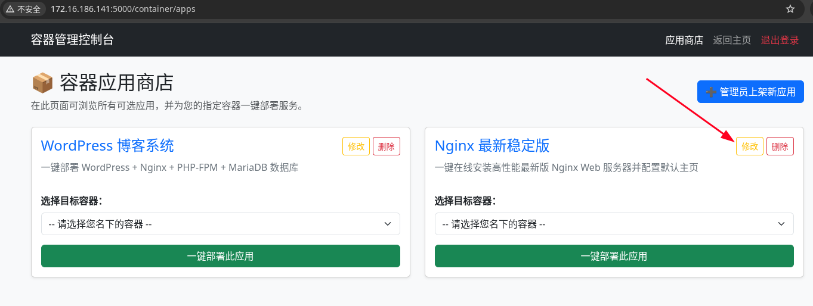
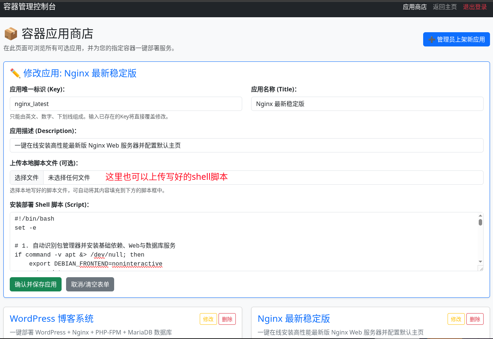
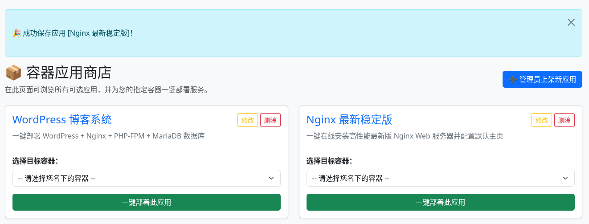
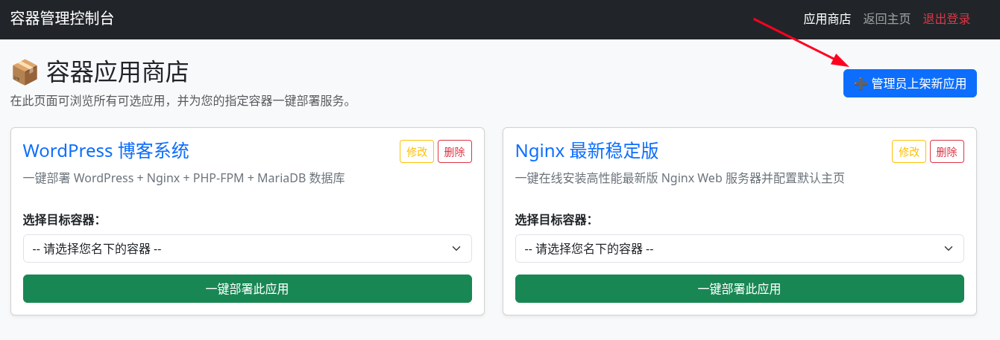
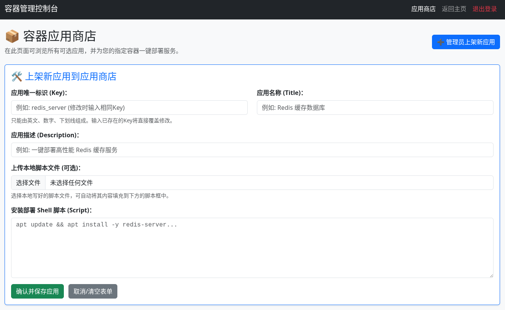

[toc]


# 前奏

> 因为要添加新功能，第二版是在第一版的基础上改的，只是把app.py拆分成几个不同的文件

```shell
# 拆分后增加了一件部署应用和管理员自定义增删改应用


rambo@debian137:~$ sudo tree /home/lxcweb/
├── app.py              # 纯后端逻辑、数据库操作、Incus 调度、应用部署脚本和路由控制
├── users.db
├── data.db             # 3个db文件是自动生成的，如果已产生了数据记得备份这些db文件
├── containers.db
└── templates/
    ├── login.html      # 登录页面的html模板
    ├── index.html      # 主控台(包含应用商店/WordPress部署、容器管理等)的html模板
    └── apps.html       # 应用商店/WordPress独立管理页面模板

文件释义：
app.py（你写的核心业务与路由逻辑）
templates/ 目录（包含你写的所有 HTML 前端页面，如 login.html, index.html, apps.html 等）
users.db（极其重要：里面存储了系统的用户账号、密码数据）
是在代码中的 init_db() 函数执行时自动创建的，用来存放系统管理员、普通用户账号密码以及租户ID

data.db 或 containers.db（根据之前的数据库设计，里面存储了容器的注册记录、端口映射、所有者配额等核心持久化数据。如果把它们删了，后台的容器列表和状态会全部丢失）
当然这2个db文件也是在应用运行过程中，根据我的数据库连接和持久化操作代码自动生成并写入容器注册记录、SSH端口及应用配置的

只要app.py源码里写了对应的数据库初始化与建表语句（如 sqlite3.connect('users.db') 等），第一次启动服务时它们就会自动生成。如果误删了它们，只要重新启动app.py，系统也会重新帮你建表(不过如果没有提前做好数据备份，原有的用户和容器绑定记录会丢失)


详见"第二版"目录中的文件
每个容器后面的"管理"中有"应用商店"，商店的实现的效果如下

```





```shell
#!/bin/bash
set -e

# 1. 自动识别包管理器并安装基础依赖、Web与数据库服务
if command -v apt &> /dev/null; then
    export DEBIAN_FRONTEND=noninteractive
    apt update
    apt install -y nginx php-fpm php-mysql mariadb-server curl unzip rsync
    systemctl enable nginx mariadb php*-fpm
    systemctl start nginx mariadb
elif command -v dnf &> /dev/null; then
    # RedHat系：自动配置 EPEL 源以确保能顺利拉取 Nginx 和 PHP
    dnf install -y epel-release || true
    dnf install -y dnf-plugins-core || true
    
    # 尝试启用可能需要的额外流（如Remi源或CodeReady Builder）
    dnf config-manager --set-enabled crb 2>/dev/null || dnf config-manager --set-enabled powertools 2>/dev/null || true
    
    dnf install -y nginx php-fpm php-mysqlnd mariadb-server curl unzip rsync
    systemctl enable nginx mariadb php-fpm
    systemctl start nginx mariadb
elif command -v apk &> /dev/null; then
    # Alpine系：使用 apk 安装
    apk update
    apk add nginx php82 php82-fpm php82-mysqli php82-json php82-openssl php82-curl php82-zlib php82-gd mariadb mariadb-client curl unzip rsync
    rc-update add nginx default
    rc-update add mariadb default
    service mariadb start
    service nginx start
fi

# 2. 自动配置 Nginx 虚拟主机支持伪静态与 PHP 解析
mkdir -p /etc/nginx/sites-available /etc/nginx/conf.d /var/www/html

if [ -d /etc/nginx/sites-available ]; then
    cat << 'EOF' > /etc/nginx/sites-available/default
server {
    listen 80 default_server;
    listen [::]:80 default_server;
    root /var/www/html;
    index index.php index.html index.htm;
    server_name _;
    location / {
        try_files $uri $uri/ /index.php?$args;
    }
    location ~ \.php$ {
        include snippets/fastcgi-php.conf 2>/dev/null || true;
        fastcgi_pass unix:/run/php/php-fpm.sock 2>/dev/null || fastcgi_pass unix:/run/php/php-fpm/www.sock 2>/dev/null || fastcgi_pass 127.0.0.1:9000;
        include fastcgi_params;
        fastcgi_param SCRIPT_FILENAME $document_root$fastcgi_script_name;
    }
    location ~ /\.ht {
        deny all;
    }
}
EOF
else
    cat << 'EOF' > /etc/nginx/conf.d/default.conf
server {
    listen 80 default_server;
    server_name _;
    root /var/www/html;
    index index.php index.html;
    location / {
        try_files $uri $uri/ /index.php?$args;
    }
    location ~ \.php$ {
        try_files $uri =404;
        fastcgi_pass unix:/run/php-fpm/www.sock 2>/dev/null || fastcgi_pass 127.0.0.1:9000;
        fastcgi_index index.php;
        fastcgi_param SCRIPT_FILENAME $document_root$fastcgi_script_name;
        include fastcgi_params;
    }
}
EOF
fi

# 3. 初始化数据库与用户
mysql -e "CREATE DATABASE IF NOT EXISTS wordpress;" 2>/dev/null || true
mysql -e "CREATE USER IF NOT EXISTS 'wpuser'@'localhost' IDENTIFIED BY 'WpPass123!';" 2>/dev/null || true
mysql -e "GRANT ALL PRIVILEGES ON wordpress.* TO 'wpuser'@'localhost'; FLUSH PRIVILEGES;" 2>/dev/null || true

# 4. 下载并部署 WordPress 源码
cd /var/www/html && rm -rf *
curl -O https://wordpress.org/latest.zip
unzip -q latest.zip
mv wordpress/* .
rm -rf wordpress latest.zip

# 5. 修正文件宿主权限并重启服务生效
chown -R www-data:www-data /var/www/html 2>/dev/null || chown -R nginx:nginx /var/www/html || true
systemctl restart nginx 2>/dev/null || rc-service nginx restart || true
systemctl restart php*-fpm 2>/dev/null || systemctl restart php-fpm 2>/dev/null || rc-service php82-fpm restart || true
```








```shell
# 因为改了app.py所以记得重启lxcweb服务
rambo@debian137:~$ sudo systemctl daemon-reload
rambo@debian137:~$ sudo systemctl restart lxcweb

```


